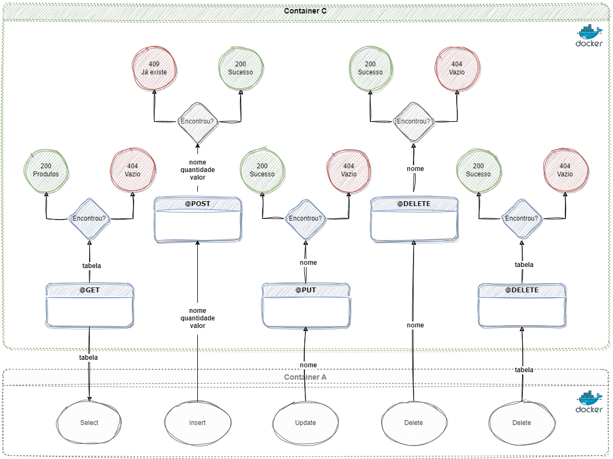

# Desenvolvimento em Full Stack (2023)

- Instituição: PUC-Rio Digital (EaD)
- Pós-graduação: *Lato Sensu*.
- Coordenação: [Marcos Kalinowski](https://www.linkedin.com/in/kalinowski/).
- Professores: [Fernando Correia](https://github.com/fernandus16), [Dieinison Braga](https://github.com/dieinisonbraga) e [Marisa Silva](https://github.com/marisa-ec).
- Aluno: [Gabriel dos Santos Reis](https://github.com/gaelsreis).

## MVP 3 - Desenvolvimento Back-end Avançado

O Produto Mínimo Viável / *Minimum Viable Product (MVP)* envolve a criação de três componentes: *frontend* consumindo uma API pública e uma API *backend*.

## Back-End

O Produto Mínimo Viável / *Minimum Viable Product (MVP)* envolve a criação de uma Interface de Processamento de Aplicações / *Application Programming Interface (API)* com cinco rotas: ler ou buscar/*select (get)*, inserir/*insert (post)*, atualizar ou substituir/*update (put)*, excluir um item/*delete (delete) e excluir tudo/*delete (delete)* - no estilo Criar, Ler, Atualizar e Remover / *Create, Read, Update and Delete (CRUD)* - desenvolvida na linguagem Python, documentada com Swagger e utilizando o banco de dados SQLite. A API REST utiliza Flask e é publicada com Dockerfile.

### Principais tecnologias utilizadas

- [Python](https://www.python.org/)
- [Flask](https://flask.palletsprojects.com/)
- [SQLAlchemy](https://www.sqlalchemy.org/)
- [OpenAPI](https://swagger.io/specification/)
- [SQLite](https://www.sqlite.org/)
- [Docker](https://www.docker.com/)

## Instruções

### Utilizando virtualização

[Instalando](https://packaging.python.org/pt_BR/latest/guides/installing-using-pip-and-virtual-environments/) pacotes usando pip e ambientes virtuais. Segue abaixo comandos para Windows:

~~~PowerShell
## Instalar virtualenv usando pip, apenas na 1ª vez
py -m pip install --user virtualenv

## Criar um ambiente virtual (antes vá até o diretório do seu projeto)
py -m venv env

## Ativar o ambiente virtual
.\env\Scripts\activate

## Instalar dependências/bibliotecas, apenas na 1ª vez
py -m pip install -r requisitos.txt

## Rodar aplicação e CTRL+C para sair
flask run --host 0.0.0.0 --port 5000

## Rodar aplicação em modo desenvolvimento e CTRL+C para sair
flask run --host 0.0.0.0 --port 5000 --reload

## Desativar o ambiente virtual
deactivate

## Comandos uteis

## Garantir que o pip está atualizado
py -m pip install --upgrade pip

## Verificar versão instalada
py -m pip --version

## Atualizar versão
py -m pip install --upgrade pip

## Instalar dependências/bibliotecas individualmente
py -m pip install aniso8601==9.0.1
py -m pip install attrs==22.1.0
py -m pip install click==8.1.3
py -m pip install Flask==2.1.3
py -m pip install Flask-Cors==3.0.10
py -m pip install flask-openapi3==2.5.2
py -m pip install flask-restx==0.5.1
py -m pip install Flask-SQLAlchemy==2.5.1
py -m pip install greenlet==1.1.3
py -m pip install gunicorn==20.1.0
py -m pip install importlib-metadata==4.12.0
py -m pip install itsdangerous==2.1.2
py -m pip install Jinja2==3.1.2
py -m pip install jsonschema==4.16.0
py -m pip install MarkupSafe==2.1.1
py -m pip install nose2==0.12.0
py -m pip install pydantic==1.10.2
py -m pip install pyrsistent==0.18.1
py -m pip install pytz==2022.2.1
py -m pip install six==1.16.0
py -m pip install SQLAlchemy==1.4.41
py -m pip install SQLAlchemy-Utils==0.38.3
py -m pip install typing_extensions==4.3.0
py -m pip install Werkzeug==2.1.2
py -m pip install zipp==3.8.1

## Atualizar pacotes
py -m pip install --upgrade requests

## Listar pacotes
pip list
pip freeze
~~~

### Utilizando contêiner

[Instalando](https://docs.docker.com/engine/install/) o [Docker](https://docs.docker.com/engine/reference/run/). Segue abaixo comandos para Windows:

~~~PowerShell
## Executar terminal como administrador
powershell start-process powershell -verb runas

## Construir imagem: como administrador, no diretório do Dockerfile e requirements.txt
docker build -t backend .

## Executar contêiner, como administrador
docker run -p 5000:5000 backend

## Comandos uteis

## Verificar se a imagem foi criada
docker images

## Remover imagem
docker rmi <IMAGE ID>

## Verificar se o contêiner está em exceução
docker container ls --all

## Parar contêiner
docker stop <CONTAINER ID>

## Destruir contêiner
docker rm <CONTAINER ID>
~~~

Abrir o projeto no [Firefox](http://localhost:5000/#/)

Abrir o projeto no [Chrome](http://127.0.0.1:5000/)

---
